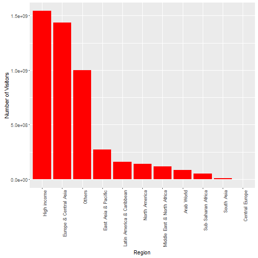

International Tourism - Number of Arrivals in India between the Years 2000 to 2014
========================================================
author: Bhuwanesh Man Rajbhandari
date: 6th May 2016
autosize: true

Brief Description of my Project
========================================================

- In my first Shiny Application I am projecting an interactive visualization of International Tourism in India between the years 2000 to 2014. 
- I have attained this data set from the database of [The World Bank](http://data.worldbank.org/indicator/ST.INT.ARVL). 
- I have updated the data formate to my need without manipulating the data. The data field contains Year, CountryName, CountryCode, Region, IncomeGroup and NoOfVisitors
- My analysis shows the Aggregations between the number of visitors and the country region they belong to.
- Another analysis shows the Aggregation between the Income Group and number of visitors of selected Country Region


Code Segments of My Project
========================================================


```r
indiatourism <- read.csv('indiatourism.csv', stringsAsFactors = FALSE)
indiatourism$NoOfVisitors <- as.numeric(indiatourism$NoOfVisitors)
indiatourism$Region <- as.factor(indiatourism$Region)
indiatourism$IncomeGroup <- factor(indiatourism$IncomeGroup
                        , levels = c("High income","Low income","Upper middle income","Others","Lower middle income")
                        , labels = c("High income","Low income","Upper middle income","Others","Lower middle income"))
names(indiatourism)
```

```
[1] "Year"         "CountryName"  "Region"       "IncomeGroup" 
[5] "NoOfVisitors"
```

Summary of data file
========================================================


```r
str(indiatourism)
```

```
'data.frame':	272 obs. of  5 variables:
 $ Year        : chr  "2000" "2000" "2000" "2000" ...
 $ CountryName : chr  "Aruba" "Andorra" "Afghanistan" "Angola" ...
 $ Region      : Factor w/ 12 levels "","Arab World",..: 7 5 11 12 5 2 8 7 5 4 ...
 $ IncomeGroup : Factor w/ 5 levels "High income",..: 1 1 2 3 3 NA 1 1 5 3 ...
 $ NoOfVisitors: num  721000 2949000 0 51000 0 ...
```

Graph: Number of visitors Vs Country Region
========================================================


